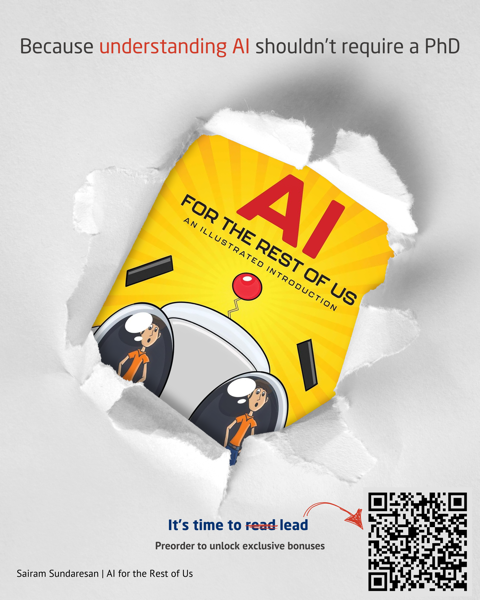
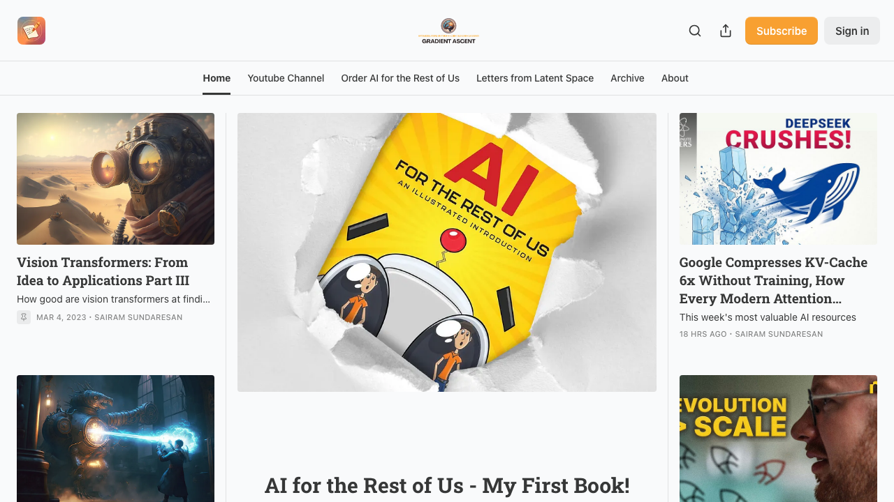

  

# Hi, I'm Sairam

**AI Engineering Leader · Author · Educator**

I lead AI/ML research at [Valeo](https://valeo.com), where my team builds computer vision for production autonomous vehicles. Since 2019, I've been ML Lead at [NASA's Frontier Development Lab](https://frontierdevelopmentlab.org), running projects on solar physics: Starspots, Solar Wind, and reconstructing the Sun's surface. Teams I've mentored have published at NeurIPS.

Earlier: eight years across Intel Labs and Qualcomm. At Qualcomm, I built the FastCV library, Touch to Track, and real-time 3D reconstruction for mobile. That work was covered in Forbes; some of it shipped in consumer devices. At Intel Labs, I focused on algorithm-hardware co-design and multimodal models. Several patents and publications from both.

Gradient Ascent, my weekly newsletter, has 27,000 readers. My readers come from diverse backgrounds, from ML engineers and PhD students to product managers, executives, and VC analysts from over 160 countries worldwide. In 2025, Bloomsbury published AI for the Rest of Us, an illustrated introduction to AI that treats the reader as intelligent without assuming a technical background.

*MSc, Electrical Engineering (Computer Vision + ML), University of Michigan. Award-winning nature photographer and illustrator.*

---

## AI for the Rest of Us

*An Illustrated Introduction · Bloomsbury · 2025*

Most AI books fall into two camps: too technical for the people who need it most, or too shallow to be useful. I wrote the one I wished existed. Illustrated, honest, and built for smart professionals who don't have a PhD.

Machine learning, natural language, computer vision, recommenders. How they actually work. Why they matter. What the hype gets wrong.

### [Buy on Amazon →](https://www.amazon.com/AI-Rest-Us-Illustrated-Introduction/dp/B0F29THNLT)

Also available at [Barnes & Noble](https://www.barnesandnoble.com/w/ai-for-the-rest-of-us-sairam-sundaresan/1147236404)

 

---

## Gradient Ascent

Weekly writing on AI and ML, trusted by Silicon Valley's top tech firms and academic labs worldwide. 27,000+ subscribers.

One idea per week. Taken seriously.

### [Subscribe →](https://newsletter.artofsaience.com)

---

## Find me

  <a href="https://artofsaience.com">artofsaience.com</a> &nbsp;·&nbsp;
  <a href="https://www.linkedin.com/in/sairam-sundaresan/">LinkedIn</a> &nbsp;·&nbsp;
  <a href="https://twitter.com/DSaience">X @DSaience</a>

